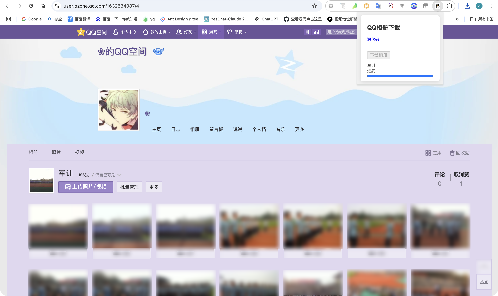

<!--
 * @Author: wz && vgqk@qq.com
 * @Date: 2024-12-15 14:42:37
 *
 * Copyright (c) 2024 by wz, All Rights Reserved.
-->

## QQ 空间相册下载 chrome 插件



## 如何使用
1、打开chrome ——> 进入`chrome://extensions/` ——> 加载已解压的扩展程序 ——> 选择这个项目<br />
2、登录 QQ 空间 ——> 进入我的相册 ——> 进入具体相册 ——> 点击插件的下载相册按钮<br />即可下载当前相册中的所有照片。
<br />

旅游相册和普通相册的接口不同，我只实现了对普通相册的处理。

## 核心流程

1. 请求拦截：
   首先拦截特定的请求 URL： `*://h5.qzone.qq.com/proxy/domain/photo.qzone.qq.com/fcgi-bin/cgi_list_photo*`，通过拦截请求 URL，插件能够获取必要的参数，用于构建后续的自定义请求，同时可以忽略一些意义不明确的字段。
2. 自定义请求参数：
   在获取到请求参数后，插件会自定义请求参数，设置 pageNum=500，这是因为该接口的最大分页限制为 500 条数据。
   如果相册中的图片数量超过 500 条，插件会使用 pageStart 参数进行轮询请求，直到获取到所有的图片数据。
3. 生成图片数组并打包下载图片：
   一旦获取到所有的图片数据，插件会生成一个数组，格式为 [{name: xxx, url: xxx}]，这里的 name 是图片的名称，url 是图片的下载链接。
   这个数组将用于后续的下载操作，接下来就是打包下载所有图片。

## 代码结构

```
└── src
    ├── assets
    │   └── icon.png
    ├── background.js #拦截特定请求
    ├── jszip.min.js #下载zip用到的sdk
    ├── photoDownloader.js #Web Worker 下载
    ├── popup.html
    ├── popup.js #交互及自定义相册接口数据的请求
    └── styles.css
```

## 提示
如果相册照片非常多，或者网络状况不好可能会出现无响应情况，可以右键插件空白处打开控制台查看日志及网络信息。


---

^ ⑉・ᴗ・⑉ ૮ ˃ 感谢支持<br />

